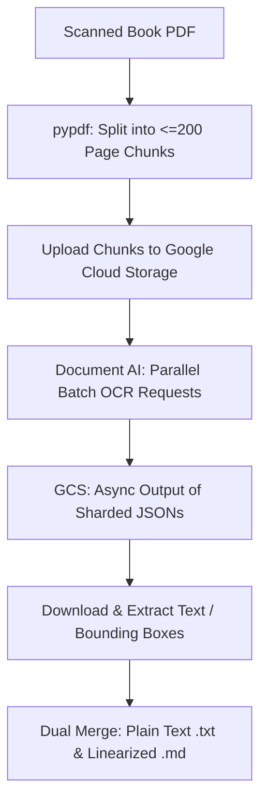
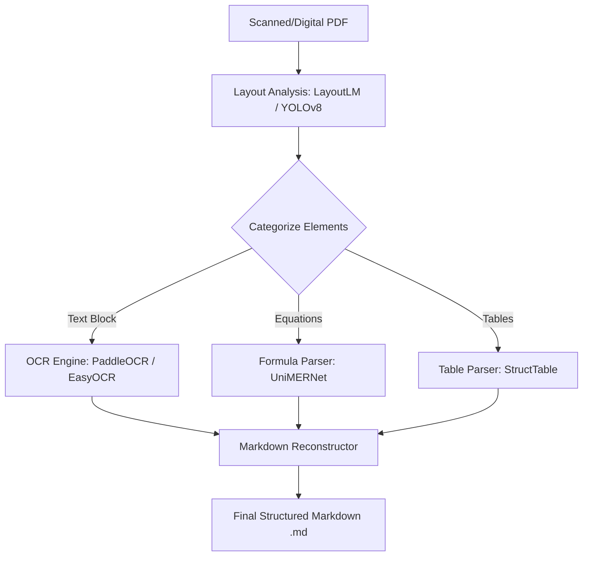
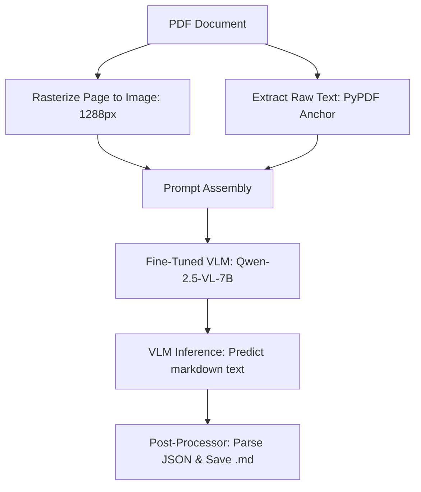

# Comparative Analysis: PDF OCR and Document Extraction Options

A comprehensive evaluation of three leading technologies for extracting text and structure from scanned PDF books: **Google Cloud Document AI (Enterprise OCR)**, **MinerU (magic-pdf)**, and **olmOCR**.

---

## Executive Summary

When digitizing scanned book libraries for academic research, the choice of OCR tool hinges on three trade-offs: **accuracy (specifically layout and equation preservation)**, **processing speed**, and **operational complexity**. 

Below is an overview of the three systems reviewed for the lab:

1. **Google Cloud Document AI (Enterprise OCR)**: The industrial-grade, cloud-based baseline. It offers unmatched raw character recognition, robust parallel batch processing, and zero local hardware dependency, but carries a pay-per-page utility cost and requires cloud infrastructure setup.
2. **MinerU (magic-pdf)**: An open-source, layout-centric pipeline designed for scientific papers and textbooks. It excels at structural parsing (columns, headers, tables) and converting LaTeX equations locally, but requires heavy local dependencies and M-series Mac or Nvidia GPU power.
3. **olmOCR**: A cutting-edge, open-source Vision-Language Model (VLM) approach by Allen AI. It represents the state of the art in semantic page reading, resolving complex multi-column reading orders and mathematical text by "viewing" the page like a human, but runs slowly and is prone to occasional VLM hallucinations without structural anchoring.

---

## 1. Google Cloud Document AI (Enterprise Document OCR)

Google's Document AI is a premium cloud service designed to extract structured text, layouts, and forms from documents. For scanned books, we leverage the **Enterprise Document OCR** processor, which combines optical character recognition with Google's advanced computer vision models.



### Technical Workflow
1. **Splitting & Uploading**: Scanned books are split into 200-page chunks (the API limit for batch requests) and uploaded to Google Cloud Storage (GCS).
2. **Asynchronous Batch Processing**: A Python script invokes `batch_process_documents`, triggering parallel processing engines on Google's cloud TPU/GPU infrastructure.
3. **Structured Output**: The service produces sharded JSON files containing the document text, layout blocks, paragraph boundaries, character coordinate bounding boxes, and orientation markers.
4. **Reassembly**: The local client script parses the coordinate grids, reconstructs the text flow, injects custom markdown structure, and merges the chunks back into contiguous `.txt` and `.md` files matching the original book names.

### Detailed Evaluation

> [!NOTE]
> **Best For**: Large-scale batch processing of highly corrupted, warped, faint, or hand-annotated historical scanned books where speed and raw text accuracy are paramount.

#### **Pros**
* **Exceptional OCR Accuracy**: State-of-the-art character recognition on difficult scans (curved pages, low contrast, bleed-through, gutter shadows).
* **Massive Parallelism**: Can process 44 books (~12,600 pages) in under 2 hours by distributing requests concurrently in the cloud.
* **Minimal Hardware Footprint**: All heavy lifting is offloaded. The local script can run on a basic laptop with negligible CPU/RAM load.
* **Auto-Language & Rotation Detection**: Automatically handles multi-lingual text and compensates for skewed/rotated pages.

#### **Cons**
* **Financial Cost**: Charges $1.50 per 1,000 pages (after the first 1,000 free pages per month). For 44 books, this is ~$17.50; for 100+ books, costs scale linearly.
* **Setup Friction**: Requires configuring a GCP account, setting up billing, managing IAM permissions, creating buckets, and authenticating via the `gcloud` CLI.
* **Mathematical Limitations**: Captures equations as raw characters rather than structured LaTeX syntax, making it less ideal for math-heavy STEM books.

---

## 2. MinerU (magic-pdf)

Developed by OpenDataLab, **MinerU** is a free, open-source PDF parsing tool designed to convert academic PDFs and scanned books into clean Markdown format. It integrates layout analysis, formula extraction, and table parsing into a unified local command-line interface.



### Technical Workflow
1. **Layout Classification**: The PDF page is rasterized and analyzed by a layout detection model (e.g., LayoutLM or YOLOv8) to categorize blocks (headings, paragraphs, footnotes, tables, figures, inline equations, block equations).
2. **Multi-Track Processing**:
   * **Text**: Handled by a traditional OCR engine (typically PaddleOCR or EasyOCR) to extract characters.
   * **Formulas**: Isolated and sent to a specialized neural network (**UniMERNet**) which translates image regions directly into clean LaTeX code.
   * **Tables**: Isolated and reconstructed using a table structure parsing model (**StructTable**) to generate HTML or Markdown tables.
3. **Markdown Assembly**: The pipeline merges the parsed blocks according to their natural reading sequence, wrapping text, generating headings, embedding tables, and writing out equations.

### Detailed Evaluation

> [!TIP]
> **Best For**: Converting textbooks, academic papers, and technical books containing dense multi-column layouts, tables, and complex math equations into highly structured, clean Markdown.

#### **Pros**
* **LaTeX Formula Extraction**: Converts mathematical formulas into LaTeX syntax (e.g., `$E=mc^2$`), a critical feature for scientific literature.
* **Open Source and Free**: No pay-per-page costs; completely self-hosted.
* **Exceptional Table Handling**: Reconstructs complex tables into actual Markdown tables rather than flat, broken text lines.
* **Natural Reading Order**: Highly effective at de-wrapping columns, preventing side-bars and footers from cutting in the middle of sentences.

#### **Cons**
* **Intense Installation Setup**: Extremely heavy installation footprint (requires PyTorch, CUDA libraries, PaddlePaddle, and downloading gigabytes of weight models). Setting it up on Apple Silicon or Windows requires navigating conflicting pip dependencies.
* **Resource Intensive**: Requires powerful local hardware. Running it on standard CPUs is prohibitively slow; it demands Apple M-series chips (M1/M2/M3/M4 Pro/Max) or Nvidia GPUs with high VRAM.
* **Scanned Quality Sensitivity**: Scanned pages with severe gutter warping or faint print can confuse the layout model, leading to missed text blocks or misclassified figures.

---

## 3. olmOCR

**olmOCR** is a state-of-the-art open-source project from the Allen Institute for Artificial Intelligence (AI2). Instead of using layout models and traditional OCR engines, it takes a radical approach: it feeds document page images directly to a **Vision-Language Model (VLM)** fine-tuned specifically for linearizing pages into clean Markdown.



### Technical Workflow
1. **Rasterization**: Pages are converted to high-resolution images (typically 1288 pixels on the longest side for olmOCR 2).
2. **Text Anchoring**: Raw, unstructured text is extracted from the PDF backend (using PyPDF) to act as a "text anchor."
3. **VLM Prompting**: The image, the anchor text, and a system prompt are compiled together. The anchor text acts as a reference to prevent the VLM from hallucinating characters or vocabulary.
4. **Direct Generation**: The page is fed to **olmOCR-2** (fine-tuned from Qwen-2.5-VL-7B-Instruct). The VLM reads the page and directly writes the corresponding Markdown representation in natural reading order.
5. **JSON Structuring**: The model outputs a JSON payload containing the Markdown content alongside useful metadata (language, rotation, document type, quality score).

### Detailed Evaluation

> [!CAUTION]
> **Best For**: Technical papers or documents where clean reading order, semantic understanding, and context-aware text correction are required, provided you have access to dedicated GPU servers.

#### **Pros**
* **Semantic OCR**: Because the model "understands" language, it can correct typos, OCR artifacts, hyphenations, and broken words on the fly based on context.
* **Flawless Multi-Column Linearization**: The VLM naturally reads the page in order, seamlessly jumping across columns, images, and text wrapping without needing strict layout bounding boxes.
* **Excellent Handwritten and Mathematical Parsing**: Reads handwriting and complex mathematical notations extremely well due to the robust vision-language training of the base Qwen-VL models.
* **Completely Free and Modifiable**: Open weights released under Apache 2.0.

#### **Cons**
* **Extremely High Compute Demand**: A 7-billion parameter vision model running inference page-by-page is extremely slow. It is designed to run on high-performance servers using vLLM or SGLang with Nvidia A100/H100 GPUs. Running it locally on a standard workstation takes a long time.
* **Hallucination Risk**: Like all generative VLMs, if a scanned page is severely degraded, the model might "hallucinate" words, fill in missing text with its own guesses, or skip passages entirely if the prompt anchoring fails.
* **Local Pipeline Complexity**: Requires managing custom model servers, setting up vLLM backends, and configuring rasterization pipelines locally.

---

## Technical Comparison Matrix

| Feature | Google Cloud Document AI | MinerU (magic-pdf) | olmOCR |
| :--- | :--- | :--- | :--- |
| **Primary Approach** | Cloud Computer Vision + OCR Engine | Local Layout Analysis + Multi-Modal Parsers | Local Vision-Language Model (VLM) |
| **Text Accuracy** | 🏆 **Extreme (Best-in-class)** | High (Depends on scan quality) | Very High (With semantic correction) |
| **Equation Handling** | Basic (Raw unicode characters) | 🏆 **Excellent (Output as LaTeX)** | Very High (Generates LaTeX syntax) |
| **Reading Order** | High (Robust block clustering) | High (YOLOv8 layout parsing) | 🏆 **Extreme (Reads naturally like human)** |
| **Local Compute Load** | 🏆 **Zero** (All in the cloud) | High (Requires Apple Silicon/GPU) | Extreme (Requires large GPU vLLM server) |
| **Cost** | Pay-as-you-go ($1.50 / 1K pages) | 🏆 **100% Free** | 🏆 **100% Free** |
| **Setup Complexity** | Medium (Cloud Console, Billing, IAM) | High (Python deps, PyTorch, YOLO weights) | Extreme (VLM serving, vLLM, local models) |
| **Batch Speed** | 🏆 **Blazing Fast** (Parallel cloud nodes) | Slow-Medium (Local serial queue) | Extremely Slow (Local serial VLM inference) |
| **Data Privacy** | Subject to Cloud Policies | 🏆 **100% Private** (Local machine) | 🏆 **100% Private** (Local machine) |

---

## Actionable Recommendations for Your Lab

To make it as easy as possible for lab members and ensure the highest quality results, we recommend using this decision matrix for incoming projects:

```mermaid
decision_chart
    id1[Type of PDF Book] -->|Standard Scan or Warped Page / Historical| id2{GCP Cloud OCR}
    id1 -->|STEM Textbook / Heavy Formulas & Tables| id3{MinerU}
    id1 -->|Highly Complex Multi-Column Layout / High-End Local GPU Available| id4{olmOCR}
```

### Recommendation 1: Google Cloud Document AI (Default Choice)
* **When to use**: For standard scanned books, humanities texts, historical scans, warped pages, or large collections where you need **results today** and do not want to spend hours troubleshooting dependencies or waiting for local scripts to finish.
* **Lab Implementation**: This is the pipeline currently configured in your repository (`ocr.py` + `ocr.sh`). It is robust, easy to run, requires no GPU, and has resume and cleanup pipelines built-in.

### Recommendation 2: MinerU (For STEM & Technical Libraries)
* **When to use**: If a lab member is digitizing chemistry, physics, math, or engineering textbooks where formulas must be converted to **LaTeX** for ingestion into other LLMs or processing systems, and you want beautiful tables.
* **Lab Implementation**: Advise the lab member to use an M-series Mac or a workstation with an Nvidia GPU, set up a dedicated virtual environment, and run `magic-pdf`.

### Recommendation 3: olmOCR (For Advanced Research)
* **When to use**: If you are working on a highly specialized project evaluating VLM extraction capabilities, processing complex multi-column papers with heavy layout overlap, and have access to a local GPU server (e.g., A100 or workstation with 24GB+ VRAM).
* **Lab Implementation**: Set up a dedicated local model server running Qwen-2.5-VL using `vLLM` or `SGLang` and call the Allen AI toolkit programmatically.
